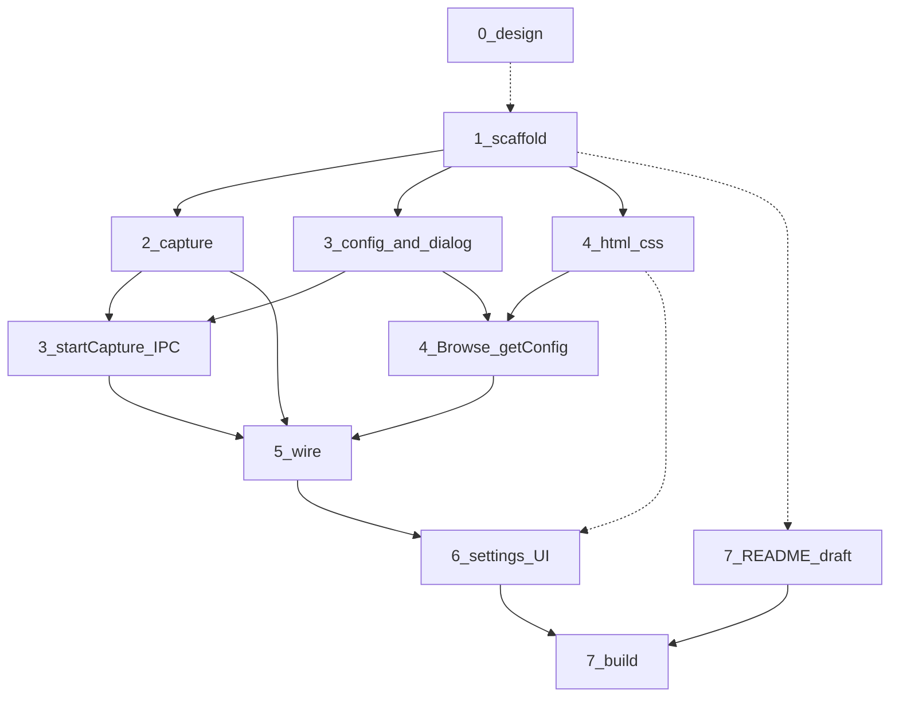

# LinkSnap v1 — phases

Paste URLs → capture PNG (optional HTML) → Explorer opens. Windows Electron.

**Repo:** https://github.com/mhd-fettah/link-snapshot.git

**Serial only at merge points** (1 → then 5 → then 7). Everything else can overlap. See **Parallel** below and in each phase file.



| Phase | File | Outcome |
|-------|------|---------|
| 0 | [phases/00-design.md](phases/00-design.md) | Tokens, layout, motion (read, don’t code) |
| 1 | [phases/01-scaffold.md](phases/01-scaffold.md) | `npm start` opens an empty window |
| 2 | [phases/02-capture.md](phases/02-capture.md) | CLI capture from a URL list |
| 3 | [phases/03-electron-ipc.md](phases/03-electron-ipc.md) | Folder picker, config, IPC stubs |
| 4 | [phases/04-ui.md](phases/04-ui.md) | Main screen, styled, no capture yet |
| 5 | [phases/05-wire.md](phases/05-wire.md) | UI runs capture, progress, cancel, auto-open |
| 6 | [phases/06-settings.md](phases/06-settings.md) | Gear: theme + viewport, persisted |
| 7 | [phases/07-ship.md](phases/07-ship.md) | README + NSIS + portable |

## Parallel

| After | Can run at the same time | Wait for merge |
|-------|--------------------------|----------------|
| Start | **0** with **1** (design is read-only) | — |
| **1** done | **2** capture, **3** config/folder IPC, **4** HTML/CSS | **5** needs 2 + 3 + 4 |
| During **2** | URL parse helper vs browser launch vs per-URL loop (same file, split if two people) | Export one `capture()` |
| During **3** | Config + folder dialog vs `startCapture` (latter needs **2**) | One preload API |
| During **4** | `styles.css` vs markup vs paste-parse JS | One `index.html` |
| After **4** markup | **6** settings card HTML/CSS (dark tokens) | Persist + viewport-in-capture needs **3** and **5** |
| Anytime | **7** README draft, builder `appId` in package.json | Real `npm run build` after **6** |

**Do not parallel 5** with unfinished 2/3/4 — wiring fights both sides. **Do not** two people edit `electron/main.js` at once; split `src/` vs `ui/` vs `electron/`.

## Locked

| | |
|---|---|
| Name | LinkSnap |
| Output | Images / Images + HTML |
| Folder | Downloads, then last used |
| Done | Auto-open Explorer |
| Files | `{hostname}-{n}` |
| Dupes | Skip + count |
| Wait | 5s |
| Viewport | 1366×900; presets in settings |
| Theme | Light/dark in settings |
| Browser | Headless → headed min → headed full |
| UI | HTML/CSS/JS, no extra packages |
| Distro | Portable + NSIS |

## Structure (after phase 1)

```
electron/main.js
electron/preload.js
src/capture.js
ui/index.html
ui/styles.css
ui/app.js
```

**v2 (not these files):** bookmark import, custom prefixes, retry-failed, locale, concurrency.
