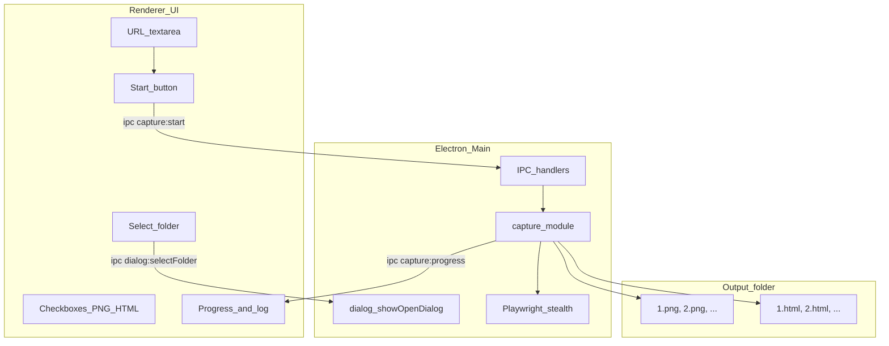

# link-snapshot v1 Implementation Plan

## Goal

Ship a **Windows Electron desktop app** where the user:

1. Pastes URLs (one per line)
2. Selects an output folder
3. Toggles **Screenshots** (on by default) and **Save HTML** (optional)
4. Runs capture and sees progress
5. Opens the output folder when done

**Out of scope for v1:** bookmark import, custom ID naming, CSV/data extraction, Mac Dubizzle content.

**Repo:** https://github.com/mhd-fettah/link-snapshot.git

---

## Todos

- [ ] Add package.json scripts/deps, folder structure (`electron/`, `src/`, `ui/`)
- [ ] Implement generic `src/capture.js` (URLs, PNG, optional HTML, progress callback, cancel)
- [ ] Add `electron/main.js` + `preload.js` with IPC for folder picker, capture, cancel, progress
- [ ] Build minimal `ui/` (textarea, folder browse, checkboxes, start/cancel, progress log, open folder)
- [ ] Configure electron-builder for Windows, update README with install/dev/build steps
- [ ] Commit and push (no co-author trailers)

---

## Architecture



- **Renderer:** plain HTML/CSS/JS (no React — keep v1 minimal)
- **Main process:** Node.js, Playwright, folder dialogs, file writes
- **IPC:** `select-folder`, `start-capture`, `cancel-capture`, progress events

---

## Project structure (to add)

```
link-snapshot/
├── package.json
├── electron/
│   ├── main.js
│   └── preload.js
├── src/
│   └── capture.js
├── ui/
│   ├── index.html
│   ├── styles.css
│   └── app.js
├── PLAN.md
└── README.md
```

---

## Core capture module — `src/capture.js`

Generalize Playwright + stealth logic (proven in Mac Dubizzle prototype):

| From prototype | v1 change |
|----------------|-----------|
| Hardcoded URL groups | Accept `urls[]` + `outputDir` + options |
| Per-folder subdirs | Flat files: `1.png`, `2.png`, … |
| UAE locale/geo headers | Generic defaults; keep stealth plugin |
| Screenshot only | Optional `saveHtml` → `page.content()` → `N.html` |
| `console.log` progress | Callback `onProgress({ index, total, url, status, error })` |

**Capture loop (per URL):**

1. Launch browser — prefer installed Chrome/Edge, fallback Chromium
2. `page.goto(url, { waitUntil: 'domcontentloaded', timeout: 90000 })`
3. Short wait (~5s) for dynamic content
4. Optional bot-block check (common "access denied" patterns)
5. If screenshots enabled → `page.screenshot({ fullPage: true })`
6. If HTML enabled → write `page.content()`
7. Report success/failure; continue on error
8. Support **cancel** flag between URLs

**URL parsing:** split by newlines, trim, filter empty, skip invalid with log warning.

---

## Electron shell

### `electron/main.js`

- `BrowserWindow` (~900×700)
- `dialog.showOpenDialog({ properties: ['openDirectory'] })`
- `ipcMain.handle('capture:start', …)` — runs capture, streams progress
- `ipcMain.handle('capture:cancel', …)` — sets cancel flag
- `shell.openPath(outputDir)` — "Open folder" button

### `electron/preload.js`

Expose via `contextBridge`:

- `selectFolder()`
- `startCapture({ urls, outputDir, savePng, saveHtml })`
- `cancelCapture()`
- `onProgress(callback)`

No `nodeIntegration` in renderer.

---

## UI — `ui/`

- **Textarea** — paste URLs
- **Output folder** — path label + Browse
- **Checkboxes** — Screenshots (checked), Save HTML (unchecked)
- **Start / Cancel** — disable Start while running
- **Progress** — `3 / 12` + scrollable log
- **Open folder** — enabled when done

Validate: at least one URL, folder selected, at least one output type checked.

---

## Dependencies — `package.json`

```json
{
  "main": "electron/main.js",
  "scripts": {
    "start": "electron .",
    "build": "electron-builder"
  },
  "dependencies": {
    "playwright": "^1.49.0",
    "playwright-extra": "^4.3.6",
    "puppeteer-extra-plugin-stealth": "^2.11.2"
  },
  "devDependencies": {
    "electron": "^33.x",
    "electron-builder": "^25.x"
  }
}
```

Post-install: `npx playwright install chromium` (fallback if Chrome/Edge missing).

---

## Packaging (Windows .exe)

- **electron-builder** in `package.json`
  - `appId`: `com.n3xt.linksnapshot`
  - `productName`: `link-snapshot`
  - Target: `nsis` or `portable`
- Prefer system Chrome to keep installer smaller
- Output in `dist/`

---

## Git workflow

- Plain commit messages only (no co-author trailers)
- Suggested commits:
  1. `Add capture engine and dependencies`
  2. `Add Electron shell and IPC`
  3. `Add UI`
  4. `Add Windows build config and README`

---

## Testing checklist

- [ ] Paste 2–3 public URLs → `1.png`, `2.png`
- [ ] Enable HTML → matching `.html` files
- [ ] Invalid URL line → logged, others continue
- [ ] Cancel mid-run → stops after current page
- [ ] Bot-protected sites → failure logged, no crash
- [ ] Open folder → Explorer opens at output path

---

## Future (v2)

- Bookmark HTML import + folder picker
- Custom filename prefix (`M4-1.png`)
- Retry failed URLs only
- Headless toggle in settings
